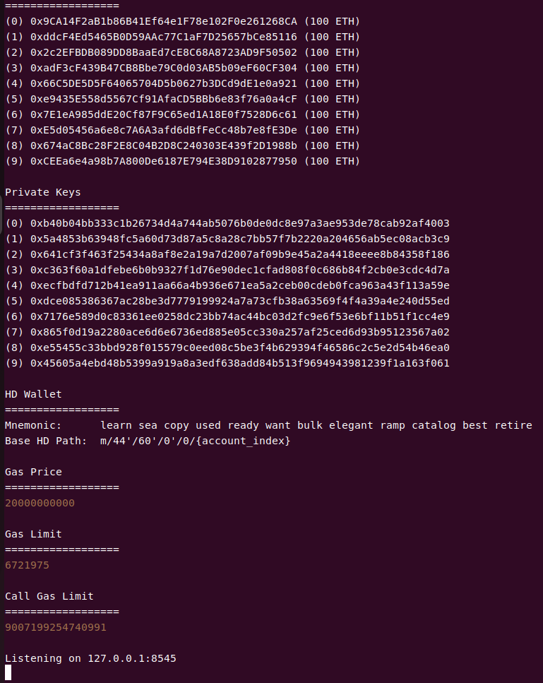
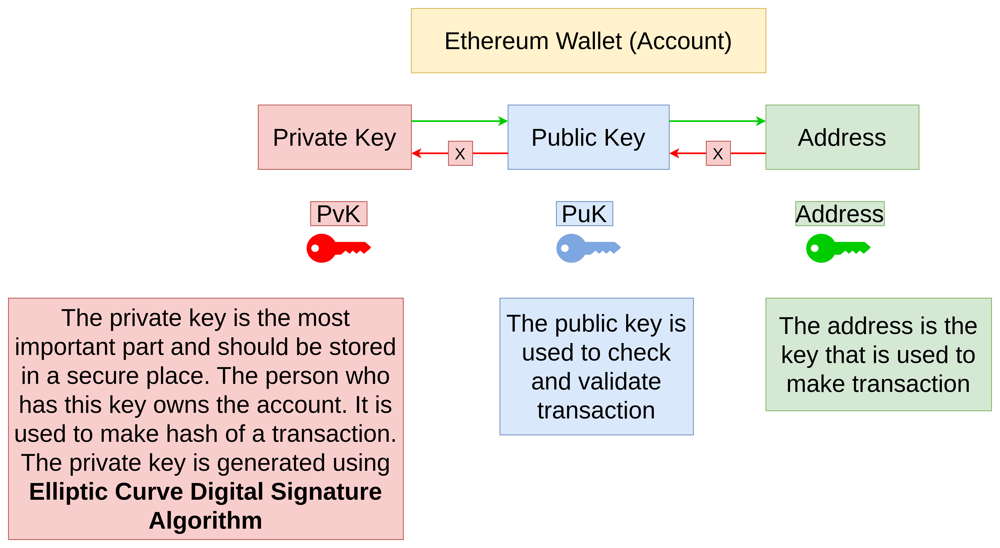
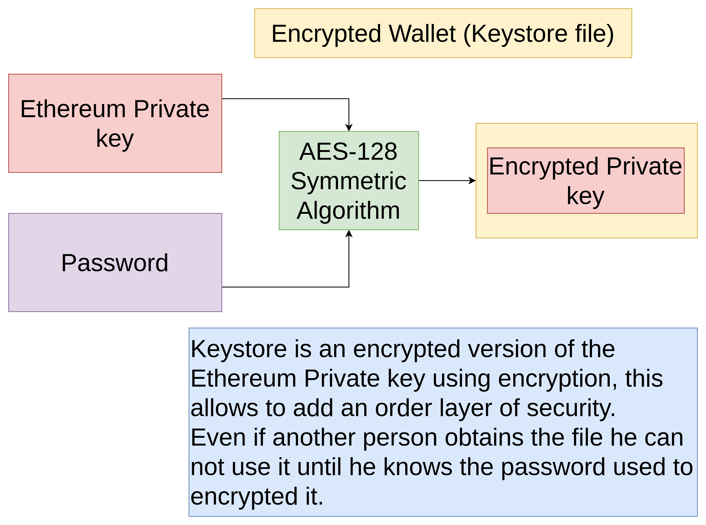

# golang-ethereum-sample

This repository is to demo how to interact with ethereum jsonrpc server by golang

## install dependency

```shell
go get github.com/ethereum/go-ethereum
```

## connect to ETH JSONRPC

```golang
package main

import (
	"context"
	"fmt"
	"log"

	"github.com/ethereum/go-ethereum/ethclient"
	"github.com/leetcode-golang-classroom/golang-ethereum-sample/internal/config"
)

func main() {
	// setup client connect to jsonprc node
	client, err := ethclient.DialContext(context.Background(), config.AppConfig.EthJsonRpcURL)
	if err != nil {
		log.Fatalf("Error to create a ether client: %v", err)
	}
	defer client.Close()
	block, err := client.BlockByNumber(context.Background(), nil)
	if err != nil {
		log.Fatalf("Error to get a block: %v", err)
	}
	fmt.Println(block.Number())
}
```

## setup local ethereum node with ganache

1. install ganache-cli
  
```shell
pnpm add -g ganache-cli
```

2. start ganache node

```shell
ganache-cli
```



## setup ENV for local node

```yaml
ETH_JSON_RPC_URL=http://localhost:8545
```

## add lookup balance logic

```golang
// find specific address balance
	addr := config.AppConfig.EthAddress
	address := common.HexToAddress(addr)

	balance, err := client.BalanceAt(context.Background(), address, nil)
	if err != nil {
		log.Fatalf("Error to get the balance:%v", err)
	}
	fmt.Println("The balance:", balance)
	// 1 ether = 10^18 wei
	fBalance := new(big.Float)
	fBalance.SetString(balance.String())
	balanceEther := new(big.Float).Quo(fBalance, big.NewFloat(math.Pow10(18)))
	fmt.Println("address:", config.AppConfig.EthAddress, "has", balanceEther, "ether")
```

## wallet concept



## write logic to generate private key, public key and address

```golang
package main

import (
	"fmt"
	"log"

	"github.com/ethereum/go-ethereum/common/hexutil"
	"github.com/ethereum/go-ethereum/crypto"
)

func main() {
	pvk, err := crypto.GenerateKey()
	if err != nil {
		log.Fatal(err)
	}
	// hex value
	pData := crypto.FromECDSA(pvk)
	// private key
	fmt.Println(hexutil.Encode(pData))

	pubData := crypto.FromECDSAPub(&pvk.PublicKey)
	// public key
	fmt.Println(hexutil.Encode(pubData))
	// address
	fmt.Println(crypto.PubkeyToAddress(pvk.PublicKey).Hex())
}
```

## wallet (keystore) concept



1. Generate keystore with password
```golang
func GenerateKeyStore() {
	// generate keystore
	key := keystore.NewKeyStore("./wallet", keystore.StandardScryptN, keystore.StandardScryptP)
	account, err := key.NewAccount(config.AppConfig.KeyStorePassword)
	if err != nil {
		log.Fatal(err)
	}
	fmt.Println(account.Address)
}
```
2. Read key from keystore with password
```golang
func ReadKeyFromKeyStore() {
	b, err := os.ReadFile(fmt.Sprintf("%s/%s", "./wallet", config.AppConfig.KeyStorefile))
	if err != nil {
		log.Fatal(err)
	}
	key, err := keystore.DecryptKey(b, config.AppConfig.KeyStorePassword)
	if err != nil {
		log.Fatal(err)
	}
	pData := crypto.FromECDSA(key.PrivateKey)
	fmt.Println("private key:", hexutil.Encode(pData))
	pubData := crypto.FromECDSAPub(&key.PrivateKey.PublicKey)
	fmt.Println("public key:", hexutil.Encode(pubData))
	address := crypto.PubkeyToAddress(key.PrivateKey.PublicKey).Hex()
	fmt.Println("address:", address)
}
```